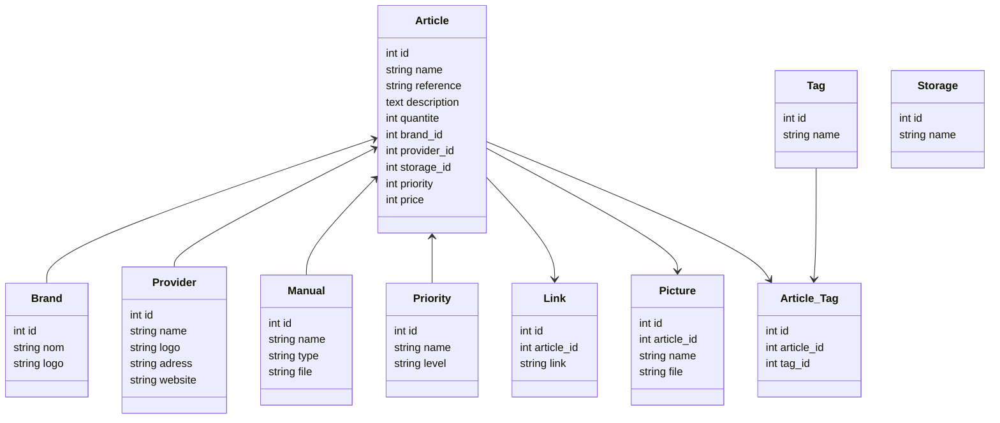

# Gestion de stock

## Diagramme

```mermaid
classDiagram 

Article <-- Brand
Article <-- Provider
Article <-- Manual
Article <-- Priority
Article --> Link
Article --> Picture
Article --> Article_Tag
Tag --> Article_Tag

class Article{
    int id
    string name
    string reference
    text description
    int quantite
    int brand_id
    int provider_id
    int storage_id
    int priority
    int price
}

class Brand{
    int id
    string nom
    string logo
}

class Provider{
    int id
    string name
    string logo
    string adress
    string website
}

class Manual{
    int id
    string name
    string type
    string file
}

class Priority{
    int id
    string name
    string level
}

class Picture{
    int id
    int article_id
    string name
    string file
}

class Link{
    int id
    int article_id
    string link
}

class Tag{
    int id
    string name
}
class Article_Tag{
    int id
    int article_id
    int tag_id
}

class Storage{
    int id
    string name
}


```
